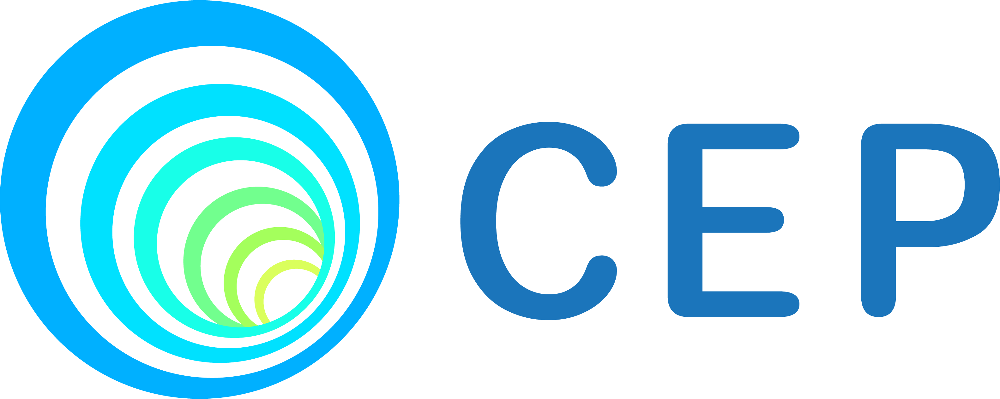
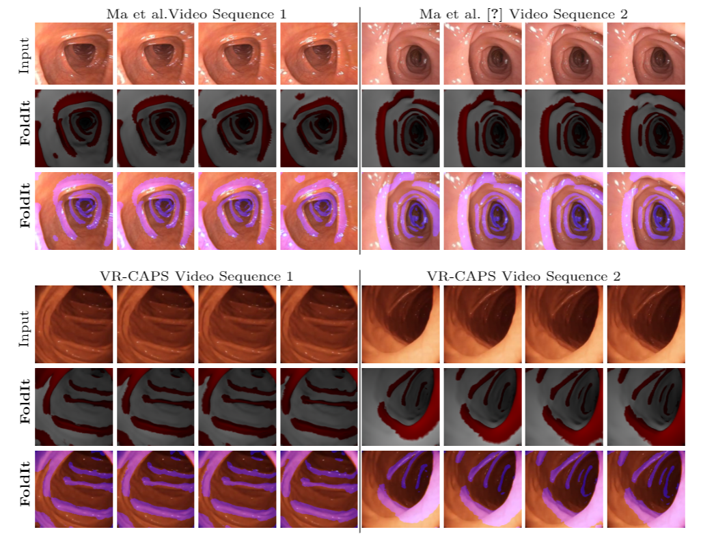
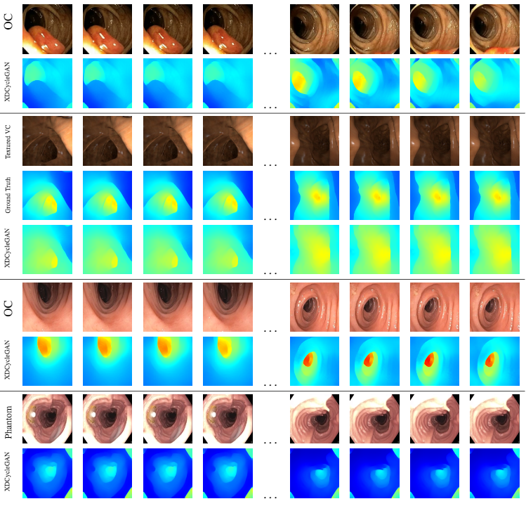

<!-- PROJECT LOGO -->
<br />
<p align="center">
    
    <h3 align="center"><strong>CEP: Computational Endoscopy Platform (advanced deep learning toolset for analyzing endoscopy videos)</strong></h3>
    <p align="center">
    <a href="https://github.com/nadeemlab/CEP/issues">Report Bug</a>
    |
    <a href="https://github.com/nadeemlab/CEP/issues">Request Feature</a>
  </p>
</p>

Computational Endoscopy Platform (CEP) provides an exhaustive deep learning toolset to handle tasks such as haustral fold annotation (in colonoscopy videos), surface coverage visualization, depth estimation and more. All our code, AI-ready training/testing data, and pretrained models will be released here with detailed instructions along with easy-to-run docker containers and Google CoLab projects.

<p align="center">
    
</p>

© This code is made available for non-commercial academic purposes.

## Updates:
- [x] AI-ready training and testing data released. This dataset is created from public [HyperKvasir](https://osf.io/mh9sj/) optical colonoscopy videos and [TCIA CT colonography](https://wiki.cancerimagingarchive.net/display/Public/CT+Colonography) repositories. Easy-to-run Docker containers and Google CoLab projects are also released. 

- [x] FoldIt **MICCAI'21** code released for haustral fold detection/segmentation in colonoscopy videos. Please cite the following paper:
> Mathew S*, Nadeem S*, Kaufman A.
> FoldIt: Haustral Folds Detection and Segmentation in Colonoscopy Videos.
> *International Conference on Medical Imaging Computing and Computer Assisted Intervention (MICCAI)*, 2021. (* Equal Contribution) (Provisionally Accepted) 
> [[Paper Link]](https://arxiv.org/abs/2106.12522) [[Supplementary Video]](https://www.youtube.com/watch?v=_iWBJnDMXjo)

- [x] XDCycleGAN **CVPR'20** code released for scale-consistent depth estimation for colonoscopy videos. Please cite the following paper:
> Mathew S*, Nadeem S*, Kumari S, Kaufman A. 
> Augmenting Colonoscopy using Extended and Directional CycleGAN for Lossy Image Translation.
> *Proceedings of the IEEE/CVF Conference on Computer Vision and Pattern Recognition (CVPR)*, 4696--4705, 2021. (* Equal Contribution) 
> [[Paper Link]](https://openaccess.thecvf.com/content_CVPR_2020/html/Mathew_Augmenting_Colonoscopy_Using_Extended_and_Directional_CycleGAN_for_Lossy_Image_CVPR_2020_paper.html) [[Supplementary Video]](https://youtu.be/9JZdnwtsE6I)

- [ ] For surface coverage visualization, we will release our **ISBI 2021** and upcoming **TMI** code:
> Mathew S*, Nadeem S*, Kaufman A.
> Visualizing Missing Surfaces In Colonoscopy Videos using Shared Latent Space Representations.
> *IEEE 18th International Symposium on Biomedical Imaging (ISBI)*, 329--333, 2021. (* Equal Contribution) 
> [[Paper Link]](https://arxiv.org/abs/2101.07280) [[Supplementary Video]](https://youtu.be/x1-wwCiYeC0)


## Prerequesites
- Python 3
- CPU or NVIDIA GPU + CUDA CuDNN

## Installation
To install the CEP, this repo needs to be cloned
```
git clone https://github.com/nadeemlab/CEP.git
cd CEP
```

Once the repo is cloned, the python libraries can be installed 
  - via pip ``` pip install -r requirements.txt ```
  - via conda ``` conda env create -f environment.yml ```

### Docker
A dockerfile is provided as an additional way to install.
  - First, [Docker](https://docs.docker.com/engine/install/ubuntu/) needs to be installed along with [NVIDIA Container Toolkit](https://docs.nvidia.com/datacenter/cloud-native/container-toolkit/install-guide.html) for GPU support
  - Build Docker Image ```docker build -t cep .```
  - Create and Run Docker Container ```docker run --gpus all --name CEP -it cep```


## [MICCAI'21] FoldIt: Haustral Folds Detection and Segmentation in Colonoscopy Videos
Haustral folds are colon wall protrusions implicated for high polyp miss rate during optical colonoscopy procedures. If segmented accurately, haustral folds can allow for better estimation of missed surface and can also serve as valuable landmarks for registering pre-treatment virtual (CT) and optical colonoscopies, to guide navigation towards the anomalies found in pre-treatment scans. We present a novel generative adversarial network, FoldIt, for feature-consistent image translation of optical colonoscopy videos to virtual colonoscopy renderings with haustral fold overlays. A new transitive loss is introduced in order to leverage ground truth information between haustral fold annotations and virtual colonoscopy renderings. We demonstrate the effectiveness of our model on real challenging optical colonoscopy videos as well as on textured virtual colonoscopy videos with clinician-verified haustral fold annotations. In essence, the **FoldIt** model is a method for translating between domains when a shared common domain is available. We use the FoldIt model to learn a translation from optical colonoscopy to haustral fold annotation via a common virtual colonoscopy domain.

<p align="center">
  
</p>
<!--  -->


To train the FoldIt model, run the following command. During the training process, results can be viewed via visdom. By default it is on http://localhost:8097.
``` 
python3 train.py --dataroot path_to_dataset -model foldit -name "foldit_model_name" 
```

To test your trained model, run the following command.

```
python3 test.py --dataroot path_to_dataset -model foldit -name "foldit_model_name"
```

Our model weights and OC testing data is provided [here](https://zenodo.org/record/4993651). We trained our model with 80 generator filters so, when testing our model use the following command

```
python3 test.py --dataroot path_to_dataset -model foldit -name "foldit_model_name" --ngf 80
```

### Dataset Format
When training, the network will look for 'trainA', 'trainB', and 'trainC' folders each containing images from domains A, B and C in the dataroot folder. During testing time, 'testA', 'testB', and 'testC' subfolders should contain images for testing.

### Public Dataset
We trained our model on public data and found the results do not differ significantly. Both the model and data can be found [here](https://zenodo.org/record/5519974).

### Google Colab
A Google Colab notebook is provided [here](https://colab.research.google.com/drive/1uvooVxTxvAC8YvvgHaV2NYtJVWIHXCLY?usp=sharing).


## [CVPR'20] Augmenting Colonoscopy Using Extended and Directional CycleGAN for Lossy Image Translation
Colorectal cancer screening modalities, such as optical colonoscopy (OC) and virtual colonoscopy (VC), are critical for diagnosing and ultimately removing polyps (precursors for colon cancer). The non-invasive VC is normally used to inspect a 3D reconstructed colon (from computed tomography scans) for polyps and if found, the OC procedure is performed to physically traverse the colon via endoscope and remove these polyps. In this paper, we present a deep learning framework, Extended and Directional CycleGAN, for lossy unpaired image-to-image translation between OC and VC to augment OC video sequences with scale-consistent depth information from VC and VC with patient-specific textures, color and specular highlights from OC (e.g. for realistic polyp synthesis). Both OC and VC contain structural information, but it is obscured in OC by additional patient-specific texture and specular highlights, hence making the translation from OC to VC lossy. The existing CycleGAN approaches do not handle lossy transformations. To address this shortcoming, we introduce an extended cycle consistency loss, which compares the geometric structures from OC in the VC domain. This loss removes the need for the CycleGAN to embed OC information in the VC domain. To handle a stronger removal of the textures and lighting, a Directional Discriminator is introduced to differentiate the direction of translation (by creating paired information for the discriminator), as opposed to the standard CycleGAN which is direction-agnostic. Combining the extended cycle consistency loss and the Directional Discriminator, we show state-of-the-art results on scale-consistent depth inference for phantom, textured VC and for real polyp and normal colon video sequences. We also present results for realistic pendunculated and flat polyp synthesis from bumps introduced in 3D VC models.


<p align="center">
  
</p>

To train the XDCycleGAN model, run the following command. During the training process, results can be viewed via visdom. By default it is on http://localhost:8097.
``` 
python3 train.py --dataroot path_to_dataset -model xdcyclegan -name "xdcyclegan_model_name" 
```

To test your trained model, run the following command.

```
python3 test.py --dataroot path_to_dataset -model xdcyclegan -name "xdcyclegan_model_name"
```
The XDCycleGAN models trained on OC and depth/VC is provided [here](https://zenodo.org/record/5335909). We trained our model with 80 generator filters so, when testing our model use the following command

```
python3 test.py --dataroot path_to_dataset -model xdcyclegan -name "xdcyclegan_model_name" --ngf 80
```

<!--
Our model weights and OC testing data is provided [here](https://zenodo.org/record/4993651). We trained our model with 80 generator filters so, when testing our model use the following command

```
python3 test.py --dataroot path_to_dataset -model foldit -name "foldit_model_name" --ngf 80
```
-->

### Dataset Format
When training, the network will look for 'trainA' and 'trainB' folders each containing images from domains A and B in the dataroot folder. During testing time, 'testA' and 'testB' subfolders should contain images for testing.

### Public Dataset
We trained our model on public data and found the results do not differ significantly. The model and data for depth esimation can be found [here](https://zenodo.org/record/5520029). The model and data for VC can be found [here](https://zenodo.org/record/5520019).

### Google Colab
A Google Colab notebook is provided for both depth and VC training [here](https://colab.research.google.com/drive/1KKAfsXoBZpix524l4PaGfHe4QDdwboTc?usp=sharing).


## [ISBI'21] Visualizing Missing Surfaces In Colonoscopy Videos using Shared Latent Space Representations [CODE COMING SOON!!!]
Optical colonoscopy (OC), the most prevalent colon cancer screening tool, has a high miss rate due to a number of factors, including the geometry of the colon (haustral fold and sharp bends occlusions), endoscopist inexperience or fatigue, endoscope field of view, etc. We present a framework to visualize the missed regions per-frame during the colonoscopy, and provides a workable clinical solution. Specifically, we make use of 3D reconstructed virtual colonoscopy (VC) data and the insight that VC and OC share the same underlying geometry but differ in color, texture and specular reflections, embedded in the OC domain. A lossy unpaired image-to-image translation model is introduced with enforced shared latent space for OC and VC. This shared latent space captures the geometric information while deferring the color, texture, and specular information creation to additional Gaussian noise input. This additional noise input can be utilized to generate one-to-many mappings from VC to OC and OC to OC. 


<p align="center">
  
</p>


## Issues
Please report all issues on the public forum.

## License
© [Nadeem Lab](https://nadeemlab.org/) - This code is distributed under **Apache 2.0 with Commons Clause** license, and is available for non-commercial academic purposes. 

## Acknowledgments
* This code is inspired by [CycleGAN and pix2pix in PyTorch](https://github.com/junyanz/pytorch-CycleGAN-and-pix2pix).

## Reference

If you find our work useful in your research or if you use parts of this code please consider citing our papers:

```
@article{mathew2021foldit,
  title={FoldIt: Haustral Folds Detection and Segmentation in Colonoscopy Videos},
  author={Mathew, Shawn* and Nadeem, Saad* and Kaufman, Arie},
  journal={International Conference on Medical Image Computing and Computer-Assisted Intervention (MICCAI)},
  year={2021}
}

@article{mathew2021visualizing,
  title={Visualizing Missing Surfaces In Colonoscopy Videos using Shared Latent Space Representations},
  author={Mathew, Shawn* and Nadeem, Saad* and Kaufman, Arie},
  journal={International Symposium on Biomedical Imaging (ISBI)},
  pages={329--333},
  year={2021}
}

@inproceedings{mathew2020augmenting,
  title={Augmenting Colonoscopy using Extended and Directional CycleGAN for Lossy Image Translation},
  author={Mathew, Shawn* and Nadeem, Saad* and Kumari, Sruti and Kaufman, Arie},
  booktitle={Proceedings of the IEEE/CVF Conference on Computer Vision and Pattern Recognition},
  pages={4696--4705},
  year={2020}
}
```
